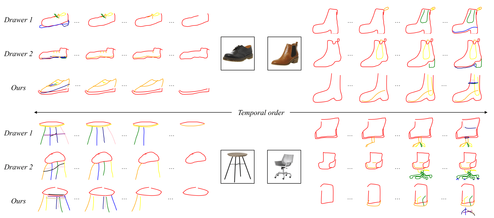
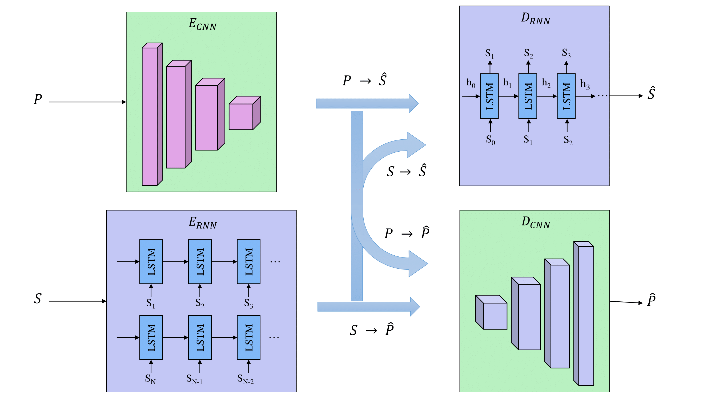
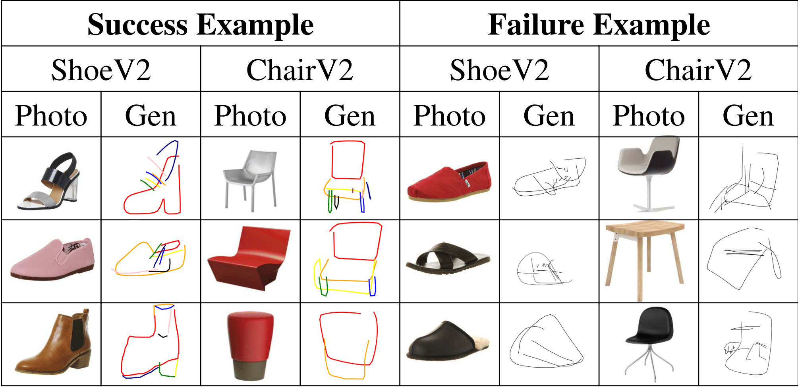

# Deep Photo-to-Sketch Synthesis Model

Before jumping in our code implementation based on [Tensorflow](https://github.com/tensorflow/tensorflow)., please refer to our paper [Learning to Sketch with Shortcut Cycle Consistency](https://arxiv.org/abs/1805.00247) for the basic idea.


This repo contains the TensorFlow code for `sketch-rnn`, the recurrent neural network model described in [Teaching Machines to Draw](https://research.googleblog.com/2017/04/teaching-machines-to-draw.html) and [A Neural Representation of Sketch Drawings](https://arxiv.org/abs/1704.03477).

# Overview

In this paper, we present a novel approach for translating an object photo to a sketch, mimicking the human sketching process. Teaching a machine to generate a sketch from a photo just like humans do is not easy. This requires not only developing an abstract concept of a visual object instance, but also knowing what, where and when to sketch the next line stroke. Figure \ref{fig:highlight} shows  that the developed photo-to-sketch synthesizer takes a photo as input and mimics the human sketching process by sequentially drawing one stroke at a time. The resulting synthesized sketches provide an abstract and semantically meaningful depiction of the given object, just like human sketches do. 

<p align="center"> </p>
<!-- -->
<!-- {:height="70px" width="40px"}-->

*Examples of our model mimicks to sketch stroke by stroke.*

# Model Structure

We aim to learn a mapping function between the photo domain *X* and sketch domain *Y*, where we denote the  empirical data distribution as *x ~ p<sub>data</sub>(x)* and *y ~ p<sub>data</sub>(y)* and represent each vector sketch segment as (*s<sub>xi</sub>*, *s<sub>yi</sub>*), a two-dimensional offset vector. Our model includes four mapping functions, learned using four subnets namely a photo encoder, a sketch encoder, a photo decoder, a sketch decoder. The illustration of our model architecture is as shown as below. 

<p align="center"> </p>

# Training a Model

To train the model you first need a dataset containing train/validation/test examples. We have provided links to the `aaron_sheep` dataset and the model will use this lightweight dataset by default.

Usage:
--------------

```bash
python sketchrnn_cnn_dual_train.py --dataset shoesv2"
```

As mentioned in the paper, before you train a photo-to-sketch (p2s) synthesis model, you need pretrain your model on the [QuickDraw](https://github.com/googlecreativelab/quickdraw-dataset) Data from the corresponding categories.

We have tested this model on TensorFlow 1.4 for Python 2.7.

# Result

Example:
--------

<p align="center"> </p>

# Datasets

The datasets for our photo-to-sketch synthesis task are *ShoeV2* and *ChairV2* datasets, which can be dowloaded from the homepage of our group [SketchX](http://sketchx.eecs.qmul.ac.uk/downloads/).

The pretraining dataset can be download from [QuickDraw](https://github.com/googlecreativelab/quickdraw-dataset) 

# Citation

If you find this project useful for academic purposes, please cite it as:

```
@Inproceedings{song2018learning,
  title             = {Learning to Sketch with Shortcut Cycle Consistency},
  author            = {Song, Jifei and Pang, Kaiyue and Song, Yi-Zhe and Xiang, Tao and Hospedales, Timothy M},
  booktitle         = {CVPR},
  year              = {2018}
}
```
